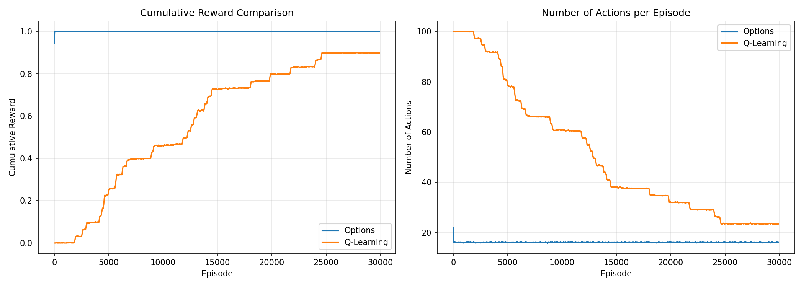

# Options Framework for the Four-Rooms Domain

> **Note**: This repository is forked from [TristanBester/options](https://github.com/TristanBester/options)

<p align="center">
    
</p>

## Overview

This repository implements and compares multiple approaches to **hierarchical reinforcement learning** in the classic Four-Rooms domain. It demonstrates how **options** (temporally extended actions) can dramatically improve both **learning efficiency** and **planning speed** compared to primitive actions alone.

The project includes:

- 🎯 **Q-Learning Baseline** - Standard tabular Q-learning with primitive actions
- 🚀 **Hard-coded Options** - Pre-defined hallway options for room navigation
- 🧠 **Option Discovery** - Automatic option learning via intrinsic motivation
- 📊 **Planning with Options** - SMDP value iteration demonstrating planning efficiency
- 📈 **Comprehensive Analysis** - Visualizations comparing all approaches

<p align="center">
    
</p>

---

## Table of Contents

- [Installation](#installation)
- [Project Structure](#project-structure)
- [Environment](#environment)
- [Approaches](#approaches)
  - [1. Q-Learning Baseline](#1-q-learning-baseline)
  - [2. Hard-coded Hallway Options](#2-hard-coded-hallway-options)
  - [3. Option Discovery](#3-option-discovery)
  - [4. Planning with Options](#4-planning-with-options)
- [Usage](#usage)
- [Results](#results)
- [References](#references)

---

## Installation

### Prerequisites

- **Python**: 3.11+
- **Poetry**: Package manager

Install Poetry:
```bash
curl -sSL https://install.python-poetry.org | python3 -
```

### Setup

Clone the repository:
```bash
git clone https://github.com/TristanBester/options.git
cd options
```

Install dependencies:
```bash
poetry install
```

Or using pip:
```bash
pip install -r requirements.txt
```

---

## Project Structure

```
options/
├── src/
│   ├── env/
│   │   └── env.py                    # Four-Rooms environment
│   ├── qlearning/
│   │   └── agent.py                  # Q-learning baseline
│   ├── options/
│   │   ├── agent.py                  # Hard-coded options training
│   │   └── options.py                # Option classes
│   ├── discovery/
│   │   ├── agent.py                  # Discovery training loop
│   │   ├── discovered_option.py      # Learned option class
│   │   ├── option_discovery.py       # Discovery manager
│   │   └── README.md                 # Discovery documentation
│   ├── planning/
│   │   ├── svi_planner.py           # SMDP value iteration
│   │   ├── hallway_options.py       # Hallway option definitions
│   │   └── README.md                # Planning documentation
│   └── main.py                       # Main entry point
├── tests/
│   ├── test_smdp_backup.py          # SMDP correctness tests
│   ├── plot_efficiency_metrics.py    # Planning visualizations
│   └── plot_mixed_comparison.py      # Mixed planning comparison
├── plots/                            # Generated visualizations
├── results/                          # Training results
├── pyproject.toml                    # Poetry configuration
├── requirements.txt                  # Pip requirements
└── README.md                         # This file
```

---

## Environment

**Four-Rooms Gridworld** - A 13×13 grid divided into four rooms connected by hallways.

**Properties:**
- **Hallway positions**: (3,6), (6,2), (7,9), (10,6)
- **Stochastic transitions**: 2/3 intended direction, 1/9 each for other three
- **Episodic task**: Navigate to a goal location
- **Reward**: +1 for reaching goal, 0 otherwise
- **Discount factor**: $\gamma = 0.99$

## Approaches

### 1. Q-Learning Baseline

**Location**: `src/qlearning/`

Standard tabular Q-learning with primitive actions (UP, DOWN, LEFT, RIGHT):

$$Q(s,a) \leftarrow Q(s,a) + \alpha[r + \gamma \max_{a'} Q(s',a') - Q(s,a)]$$

### 2. Hard-coded Hallway Options

**Location**: `src/options/`

Eight pre-defined options for room-to-hallway navigation:

| Option | Initiation | Target | Description |
|--------|-----------|--------|-------------|
| Room1→Right | Room 1 | (3,6) | Navigate to right hallway |
| Room1→Bottom | Room 1 | (6,2) | Navigate to bottom hallway |
| Room2→Left | Room 2 | (3,6) | Navigate to left hallway |
| Room2→Bottom | Room 2 | (7,9) | Navigate to bottom hallway |
| Room3→Top | Room 3 | (6,2) | Navigate to top hallway |
| Room3→Right | Room 3 | (10,6) | Navigate to right hallway |
| Room4→Top | Room 4 | (7,9) | Navigate to top hallway |
| Room4→Left | Room 4 | (10,6) | Navigate to left hallway |

**Learning**:

$$Q(s,o) \leftarrow Q(s,o) + \alpha[r + \gamma^k V(s') - Q(s,o)]$$

where $k$ is the option duration.

### 3. Option Discovery

**Location**: `src/discovery/`

Automatic option discovery using **intrinsic motivation**:

**Algorithm**:
1. **Detect salient events**: Doorway crossings, novel states
2. **Spawn options**: Create new option targeting that event
3. **Learn policies**: Q-learning with intrinsic + extrinsic rewards
4. **Prediction learning**: Track event predictability
5. **Intrinsic decay**: As prediction improves, intrinsic reward decreases

**Intrinsic Reward**:

$$r_{\text{intrinsic}} = \text{scale} \times |\text{actual\\_event} - \text{predicted\\_event}|$$

**Intra-option learning**: Updates all consistent options simultaneously

### 4. Planning with Options

**Location**: `src/planning/`

**Synchronous Value Iteration** with proper SMDP backups using the **fundamental matrix approach**:

**SMDP Bellman Equation**:

$$V(s) = \max_{o \in \mathcal{O}(s)} \left[ r_o(s) + \sum_{s'} p_{ss'}^o V(s') \right]$$

Where:
- $r_o(s) = \mathbb{E}\left[\sum_{t=0}^{\tau-1} \gamma^t r_t \mid s,o\right]$ (expected discounted reward)
- $p_{ss'}^o = \mathbb{E}\left[\gamma^\tau \mathbb{1}(s_\tau=s') \mid s,o\right]$ (expected discounted termination)
- $\tau$ = random option duration

**Fundamental Matrix**:

$$N = (I - \gamma P_{II})^{-1} = \sum_{k=0}^{\infty} \gamma^k P_{II}^k$$

Enables efficient computation:
- Rewards: $r_o(s) = N \cdot r_I$
- Termination: $p_{ss'}^o = \gamma \cdot N \cdot P_{IB}$

---

## Usage

### Training Agents

**Q-Learning baseline:**
```python
from src.env.env import FourRooms
from src.qlearning.agent import train

env = FourRooms()
rewards, steps = train(env, n_episodes=30000)
```

**Hard-coded options:**
```python
from src.options.agent import train_options

rewards, steps = train_options(env, n_episodes=30000)
```

**Option discovery:**
```python
from src.discovery.agent import train_discovery

rewards, steps = train_discovery(env, n_episodes=30000)
```

### Planning with Options

**Compare planning efficiency:**
```python
from src.planning.svi_planner import SVIPlanner
from src.planning.hallway_options import get_hallway_options, get_primitive_actions

# Plan with primitives
primitives = get_primitive_actions()
planner_prim = SVIPlanner(env, primitives, gamma=0.99)
iters_prim = planner_prim.plan(goal_state=(3, 6))

# Plan with options
options = get_hallway_options()
planner_opt = SVIPlanner(env, options, gamma=0.99)
iters_opt = planner_opt.plan(goal_state=(3, 6))

print(f"Speedup: {iters_prim/iters_opt:.2f}x faster with options")
```

### Running Tests

**SMDP backup verification:**
```bash
python tests/test_smdp_backup.py
```

**Plot planning efficiency:**
```bash
python tests/plot_efficiency_metrics.py
python tests/plot_mixed_comparison.py
```

---

## Results

### Learning Performance

<p align="center">
    
</p>

**Key findings:**
- Hard-coded options learn **~2x faster** than Q-learning baseline
- Discovery approaches baseline performance but requires more exploration
- Options reduce credit assignment problem across rooms

### Planning Efficiency

<p align="center">
    
</p>

**Key findings:**
- Options converge in **3-5x fewer iterations**
- Better **value propagation** per computational step
- **Mixed planning** (primitives + options) combines benefits of both

### Value Evolution

<p align="center">
    
</p>

**Key findings:**
- Start state value improves **much faster** with options
- Options discover useful behavior earlier
- Demonstrates efficiency of temporal abstraction

## References

**Sutton, R. S., Precup, D., & Singh, S. (1999).** Between MDPs and semi-MDPs: A framework for temporal abstraction in reinforcement learning. *Artificial Intelligence*, 112(1-2), 181-211.

## Acknowledgments

This repository is forked from [TristanBester/options](https://github.com/TristanBester/options), which provided the foundation for the Q-learning baseline and hard-coded options implementation. Additional modules for option discovery and planning with SMDP value iteration have been added to this fork.

This implementation is inspired by the seminal work on options framework by Sutton, Precup, and Singh, and the intrinsic motivation work by Singh, Barto, and Chentanez.

